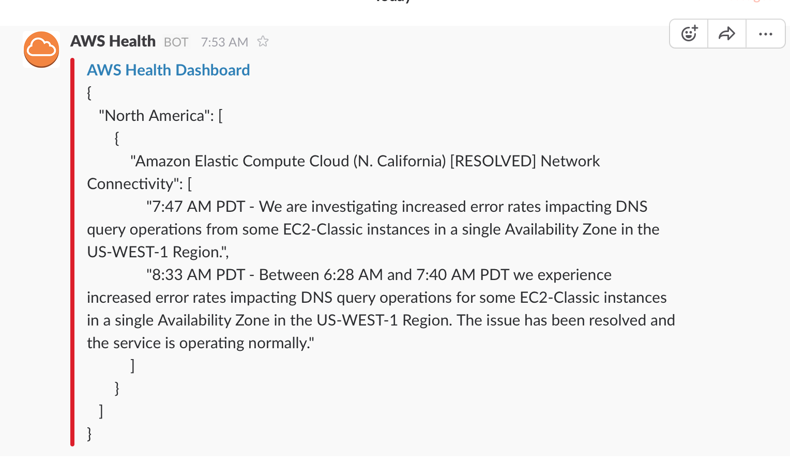

# AWS Service Health Dashboard slackbot

## Usage

There are three primary ways which the service health check slackbot works.

1. Scheduled via Cloudwatch Event

2. Via the API Gateway URL:

```sh
curl -s https://$API_ID.execute-api.us-west-2.amazonaws.com/prod/aws_status
```

3. Custom slash command:
```
/aws_status
```



## Slack setup (part 1)

### Incoming Webhooks
1. Build a `Custom Integration` using `Incoming WebHooks`to the desired channel (e.g. #aws_health).
2. Add the incoming webhooks integration and enter "AWS Health" for the `Customize Name` (additionally customize the Descriptive Label and icon if desired).
3. Note the `Webhook URL` and save the settings.

## AWS setup

### Export AWS credentials

The CLI commands below require the following environmental variables:

```sh
AWS_DEFAULT_REGION=us-west-2
AWS_DEFAULT_PROFILE=aws_profile
AWS_SECRET_ACCESS_KEY=########################################
AWS_ACCESS_KEY_ID=AKIA################
```

### Create a `Simpledb` domain:

```sh
$ aws sdb create-domain \
--domain-name aws-status
--profile aws_profile
```

### Create an `IAM role`
(and capture output to $ROLE_ARN)

```sh
$ ROLE_ARN=$(aws iam create-role \
--role-name lambda_aws_status \
--assume-role-policy-document '{
  "Version": "2012-10-17",
  "Statement": {
    "Effect": "Allow",
    "Principal": {"Service": "lambda.amazonaws.com"},
    "Action": "sts:AssumeRole"
  }
}' \
--query 'Role.Arn' \
--output text)
```

#### Attach an inline `IAM policy` to the `IAM role`

```sh
$ aws iam put-role-policy \
--role-name lambda_aws_status \
--policy-name lambda_aws_status \
--policy-document file://lambda_aws_status_policy.json
```

### Creating the Lambda .zip package

1. Edit `aws_status.py` and edit as needed (i.e. provide Slack channel webhook URL).

2. Create the `Lambda` package:

```sh
$ sh create_lambda_package.sh
```

### Create a new Lambda function and upload

```sh
$ aws lambda create-function \
--function-name aws_status \
--zip-file fileb://aws_status.zip \
--role $ROLE_ARN \
--handler aws_status.lambda_handler \
--runtime python2.7 \
--timeout 5
```

### Create a REST API endpoint

```sh
$ ACCT_ID=$(aws ec2 describe-security-groups \
--group-names 'Default' \
--query 'SecurityGroups[0].OwnerId' \
--output text) ; \
echo "account_id: $ACCT_ID"

$ API_ID=$(aws apigateway create-rest-api \
--name aws_status \
--query 'id' \
--output text) ;\
echo "api_id: $API_ID"

$ ROOT_ID=$(aws apigateway get-resources \
--rest-api-id $API_ID \
--query 'items[].id' \
--output text) ;\
echo "root_id: $ROOT_ID"

$ RESOURCE_ID=$(aws apigateway create-resource \
--rest-api-id $API_ID \
--parent-id $ROOT_ID \
--path-part aws_status \
--query 'id' \
--output text) ;\
echo "resource_id: $RESOURCE_ID"

$ aws apigateway put-method \
--rest-api-id $API_ID \
--resource-id $RESOURCE_ID \
--http-method GET \
--authorization-type NONE

$ aws apigateway put-integration \
--rest-api-id $API_ID \
--resource-id $RESOURCE_ID \
--http-method GET \
--type AWS \
--integration-http-method POST \
--uri "arn:aws:apigateway:us-west-2:lambda:path//2015-03-31/functions/arn:aws:lambda:us-west-2:$ACCT_ID:function:aws_status/invocations"

$ aws apigateway put-integration-response \
--rest-api-id $API_ID \
--resource-id $RESOURCE_ID \
--http-method GET \
--status-code 200 \
--response-templates "{\"application/json\": \"\"}"

$ aws apigateway put-method-response \
--rest-api-id $API_ID \
--resource-id $RESOURCE_ID \
--http-method GET \
--status-code 200 \
--response-models "{\"application/json\": \"Empty\"}"

$ aws apigateway create-deployment \
--rest-api-id $API_ID \
--stage-name prod

$ aws lambda add-permission \
--function-name aws_status \
--statement-id apigateway-aws_status \
--principal apigateway.amazonaws.com \
--action lambda:InvokeFunction \
--source-arn "arn:aws:execute-api:us-west-2:$ACCT_ID:$API_ID/*/GET/aws_status"
```

### Optionally create a scheduled event (recommended)

```sh
$ aws events put-rule \
--name lambda_aws_status_cron_3m \
--schedule-expression "rate(3 minutes)"

$ FUNC_ARN=$(aws lambda get-function \
--function-name aws_status \
--query 'Configuration.FunctionArn' \
--output text)

$ aws events put-targets \
--rule lambda_aws_status_cron_3m \
--targets Id=1,Arn=$FUNC_ARN
```

## Slack setup (part 2)

### Custom Slash Command

1. Build another Custom Integration with `Slash Commands`.
2. Enter "/aws_status" in the `Choose a Command` field then `Add Slash Command Integration`.
3. Enter "https://$API_ID.execute-api.us-west-2.amazonaws.com/prod/aws_status" as `Invoke URL` where `$API_ID` is the API Gateway REST API ID.
4. Set `Method` to `GET`.
5. Enter "AWS Health" for `Customize Name`.
6. Under `Autocomplete help text`, check `Show this command in the autocomplete list` and enter "Check AWS Service Health Dashboard for events".
7. `Save Integration`.
